<p align="center">
  
  &nbsp;&nbsp;&nbsp;&nbsp;&nbsp;&nbsp;&nbsp;&nbsp;&nbsp;&nbsp;&nbsp;&nbsp;&nbsp;&nbsp;
  
</p>

# AML Transaction Monitoring: Feature Selection and Prediction Explainability

**Aaron Zeller · Alicia Larsen · Marie-Louise Dugua · Vincent Dörig**

---

## Project Overview

Anti-Money Laundering (AML) systems generate large numbers of alerts, but many are false positives and often lack clear explanations. This makes investigations time-consuming and reduces trust in automated detection.

This project develops an **explainable AML alerting tool** that combines interpretable machine learning with an interactive dashboard to support AML compliance officers during the investigation process.

### Project Goals

- **Improve transparency** by exposing the features driving model predictions using techniques such as *Shapley values* and *partial dependence plots*.
- **Reduce false positives** by supporting human-in-the-loop verification and incorporating domain expertise.
- **Support efficient investigations** through an interactive dashboard that enables rapid alert triage.
- **Ensure auditability and fairness** by generating clear, traceable explanations for model decisions.

By combining machine learning with human expertise, the project aims to make AML monitoring **more efficient, interpretable, and reliable**.

### Research Question 

To what extent can feature investigation–centred explainability and auditability frameworks in AML systems improve operational efficiency and reduce misclassification rates, without compromising fairness and regulatory transparency?

---

## Milestones

### 🎥 Milestone I — Description Video

- 📹 Description video:  
  https://polybox.ethz.ch/index.php/s/k7ECKZLxsXcFqTa

- 📑 Presentation slides:  
  https://polybox.ethz.ch/index.php/s/fidpD6dj3gJWdj4

---

### 🧩 Milestone II — Visual Encoding Sketches & Backend

The visual encoding sketches and interactive mockup for this milestone are located in
[`mockup/`](/Users/aaronzeller/Documents/FS26/XML/QuantumQuokka/mockup).

From a software perspective, this milestone includes a standalone React/Vite mockup of the AML dashboard, a preprocessing script to derive frontend-ready data from the AMLworld dataset, and supporting source files required to reproduce the visual prototype locally. The mockup was kept self-contained so that the visual encoding work can be reviewed independently from the main application code.

Here is the architecture diagram of the overall application:



The milestone mockup can still be run independently from [`mockup/frontend`](/Users/aaronzeller/Documents/FS26/XML/QuantumQuokka/mockup/frontend):

```bash
cd mockup/frontend
npm install
npm run dev
```

---

### 📊 Milestone III — Static Dashboard
Milestone III delivered the first fully deployed version of the dashboard, including the Vite frontend, the FastAPI backend, and the PostgreSQL database running in Kubernetes.

What works in this milestone:
- the dashboard is deployed and reachable at [https://quantumquokka.xaiml26.ivia.isginf.ch](https://quantumquokka.xaiml26.ivia.isginf.ch)
- the frontend loads transaction records, dashboard summary metrics, and alert previews from the backend API
- the backend serves the AML monitoring endpoints and connects to PostgreSQL for transaction storage and retrieval
- the database is initialized from the AMLworld transaction data and used as the persistent data source for the deployed application

From a systems perspective, this milestone established the production path for the project: a frontend hosted in the cluster, a backend that exposes the monitoring endpoints, and a PostgreSQL instance that stores the transaction data used by the dashboard.

---

### 🤖 Milestone IV — Machine Learning Integration
Milestone IV integrated the machine-learning pipeline used by the dashboard. The backend trains and serves an XGBoost binary classifier for suspicious transaction detection, using the AMLworld transaction data stored in PostgreSQL.

What works in this milestone:
- the model uses transaction time, amounts, banks, accounts, countries, currencies, and payment format as input features
- numerical fields are transformed before training, while high-cardinality categorical fields are encoded with stable hashing
- class imbalance is handled through positive-class weighting and a recall-oriented decision threshold
- the backend returns model scores, predicted alert labels, SHAP-style feature contributions, evaluation metrics, and ROC data
- predictions are cached by model and transaction identifier to reduce repeated inference latency

From a modelling perspective, this milestone turned the dashboard from a static monitoring interface into a model-backed AML explanation system.

---

### 🖥️ Milestone V — Interactive Dashboard
Milestone V focused on the analyst-facing workflow and interaction design. The dashboard now supports progressive inference streaming, global and local explanations, feature toggling, and alert triage.

What works in this milestone:
- the interface first streams a curated representative sample and then continues with the full transaction database
- the Overview tab combines feature controls, global SHAP views, model metrics, a confusion matrix, and an ROC curve
- the Transactions tab supports alert-level investigation with a SHAP waterfall, transaction details, and a geographic route view
- feature toggling acts as a counterfactual probe by estimating model behaviour when selected information is unavailable
- alerts can be triaged into simplified AML workflow states such as In Review, Closed, and MROS Review

From an interaction perspective, this milestone connected model outputs to an explainable workflow for AML officers, keeping the model as decision support rather than an automated final judgement.

---

## Project Setup

The current application is run through Docker Compose from the project root. It starts the Vite frontend, FastAPI backend, PostgreSQL database, and supporting microservice together:

```bash
docker compose up --build
```

After startup, the local services are available at:
- frontend dashboard: http://localhost:3000
- backend API: http://localhost:8080
- microservice: http://localhost:8081
- PostgreSQL: localhost:5432

The Docker setup uses the frontend in [`frontend/vite`](/Users/aaronzeller/Documents/FS26/XML/QuantumQuokka/frontend/vite), the backend in [`backend/src`](/Users/aaronzeller/Documents/FS26/XML/QuantumQuokka/backend/src), and the AMLworld source data from [`mockup/data_sources`](/Users/aaronzeller/Documents/FS26/XML/QuantumQuokka/mockup/data_sources).

---

## Sources

### Datasets

- **IBM AML Transactions Dataset (AMLworld)**  
  https://www.kaggle.com/datasets/ealtman2019/ibm-transactions-for-anti-money-laundering-aml  

- **Synthetic Transaction Monitoring Dataset (SAML-D)**  
  https://www.kaggle.com/datasets/berkanoztas/synthetic-transaction-monitoring-dataset-aml  

### Papers

- **Altman et al. — Realistic Synthetic Financial Transactions for Anti-Money Laundering Models (AMLworld)**  
  https://dl.acm.org/doi/10.5555/3666122.3667422  

- **Öztaş et al. — Synthetic AML Dataset (SAML-D)**  
  https://ieeexplore.ieee.org/document/10356193

---

## Contribution

The project work was shared evenly across the team. Many design decisions, frontend changes, website-structure adaptations, and debugging sessions were done jointly in group meetings, often while working together on a single device. This makes it difficult to separate each individual contribution precisely, but the larger task areas were roughly divided as follows.

Aaron and Alicia focused on the initial frontend implementation, while Vincent and Marie-Louise focused on the initial backend. Later optimisations were contributed by multiple team members. Aaron and Marie-Louise worked mainly on the machine-learning integration and further technical improvements, while Alicia and Vincent focused on the poster and report. Alicia and Vincent also contributed to website design, debugging, and research. Overall, both the implementation and design direction were shaped collaboratively throughout the project.
